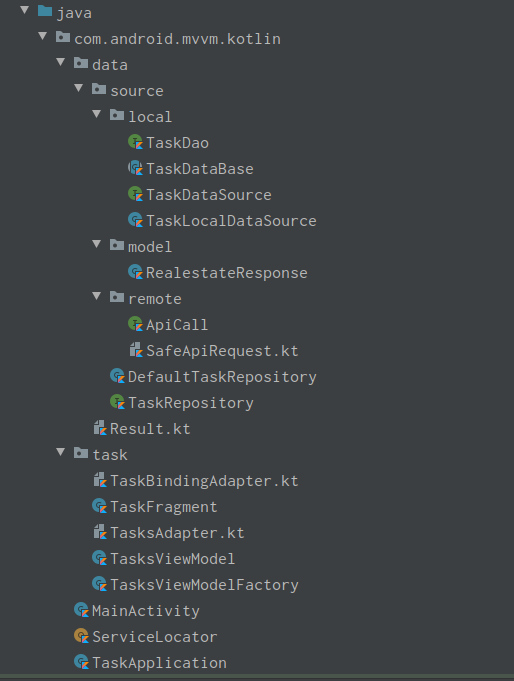
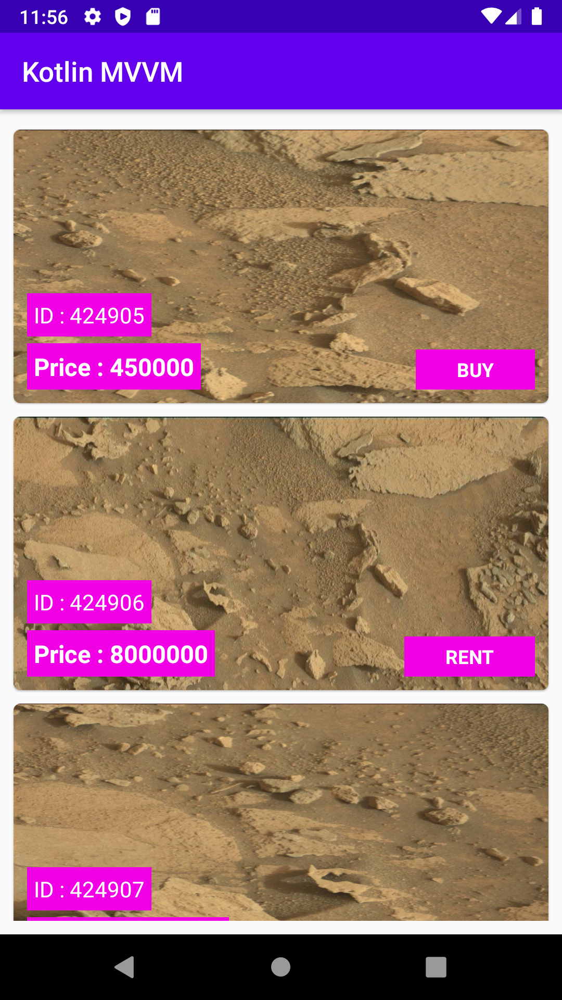

# Android-Kotlin-MVVM
Android Kotlin MVVM

<!-- #######  THIS IS A COMMENT - Visible only in the source editor #########-->
<h3><strong>This repository contains a detailed sample app that implements MVVM architecture using Kotlin, Android Jetpack components.</strong></h3>

<strong>Used Libraries:</strong>

<ul>
<li><strong><a href="https://developer.android.com/topic/libraries/architecture/livedata">LiveData</a> (Observable data)</strong></li>
<li><strong><a href="https://developer.android.com/topic/libraries/architecture/viewmodel">ViewModel</a> (Store and manage UI-related data)</strong></li>
<li><strong><a href="https://github.com/Kotlin/kotlinx.coroutines">Kotlin Coroutine</a> (Light-weight threads)</strong></li>
<li><strong><a href="https://developer.android.com/topic/libraries/architecture/navigation/">Navigation</a> (Fragment transitions)</strong></li>
<li><strong><a href="https://developer.android.com/topic/libraries/architecture/room">Room</a> (Abstraction layer over SQLite)</strong></li>
<li><strong><a href="https://github.com/square/retrofit">Retrofit2</a> (HTTP client)</strong></li>
<li><strong><a href="https://developer.android.com/kotlin/ktx">Ktx</a> (Kotlin extension)</strong></li>
<li><strong><a href="https://github.com/bumptech/glide">Glide</a> (Image Loading)</strong></li>
</ul>

<strong>Architecture:</strong>

This project follows Android architecture guidelines that are based on MVVM.

<strong>App Folder Structure:</strong>

<strong>App Screen:</strong>

